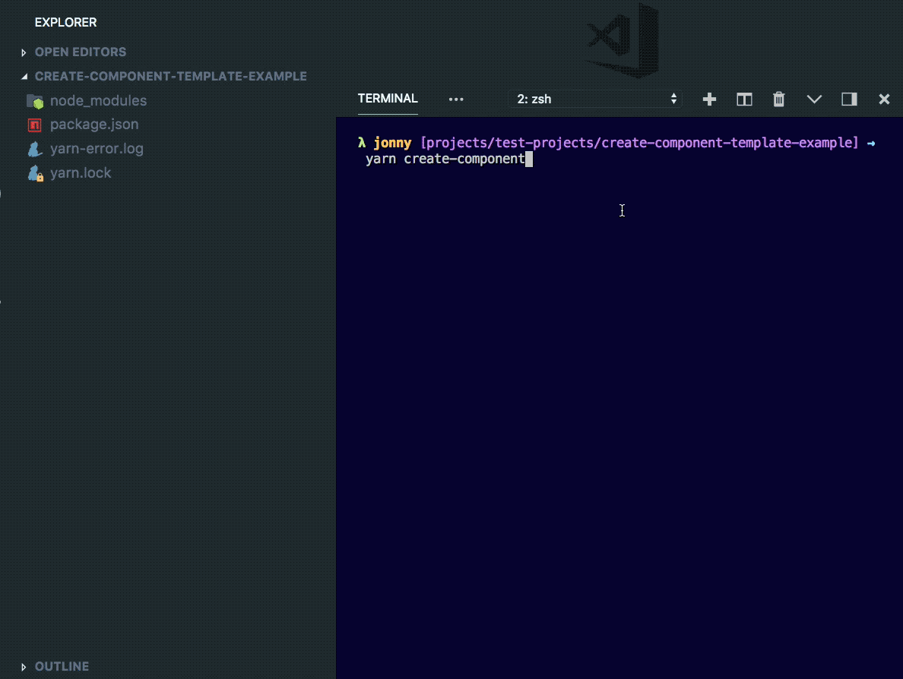

# Create Component Template

Creates components from templates. Useful for component libraries (monorepos).

Originally made to generate React components but can be used as a generic code generator.

<p align="center">
  
</p>

# Installation

```sh
npm i -D create-component-template
```

# Usage

## Template Directory

First, create a templates directory of the same structure as you wish to structure your component in.

This can be placed anywhere within your app's directory and pointed to using the `cct.config` file (see below).

Example Template Directory:

```sh
templates
├── component.template.js
├── fixture.template.js
├── package.json.template.js
├── scss.template.js
└── test.template.js
```

Each file should be a function that takes a component name and returns an es6 template literal.

The component name should be injected with string interpolation where required. Like so:

```js
module.exports = componentName => `\
// @flow

import React, { PureComponent } from 'react';

type Props = {
  /** CSS modules style object */
  theme: {
    class${componentName}: string
  }
};

/**
 * NavBar
 * @extends PureComponent<Props>
 */
class ${componentName} extends PureComponent<Props> {
  render() {
    const { class${componentName} } = this.props;
    return (
      <div className={class${componentName}}>
        <h1>Hello from ${componentName}</h1>
      </div>
    );
  }
}

export default ${componentName};
`;
```

For more examples look in the `src/templates` directory.

The `src/templates` directory is used by default if no custom templates and config are provided.

## Config File

The config file tells `create-component-template` where your templates are stored and how to use them.

`create-component-template` will look for the config file in the following places in this order:

1. the location provided using the cli option `-c` or `--config` and *any* given filename
2. in the root dir of the project under `cct.config`
3. as part of the `package.json` file under `cct.config`

Finally, if none of these options are found it will default to using default templates.

A config file should be structured like so:

```js
module.exports = {
  templatesDirectory: 'config/templates',
  templates: [
    {
      folderName: '__fixtures__',
      templateName: 'fixture.template.js',
      extension: '.fixture.js'
    },
    {
      folderName: '__tests__',
      templateName: 'test.template.js',
      extension: '.test.js'
    },
    {
      folderName: '__themes__',
      templateName: 'scss.template.js',
      extension: '.scss'
    },
    {
      fileName: 'package.json',
      templateName: 'package.json.template.js',
      extension: '.json'
    },
    {
      fileName: 'index.js',
      templateName: 'component.template.js',
      extension: '.js'
    }
  ]
};
```

- `templatesDirectory` - the relative path to your templates directory.
- `templates` - an array of template config objects.

- `extension` - the custom file extension you wish to provide.
- `templateName` - the name of the template file to use.
- `fileName` - (optional) what to call the file. otherwise use the user prompt provided name.
- `folderName` - (optional) specify this if you wish to place the file inside a folder with said name.

> TIP: Use multiple config files that use the same templates directory in order to get different configurations. You can also use Object.assign/ the spread operator to share the majority of config file contents.

## CLI Options

```
create-component [command]

Commands:
  create-component    Scaffolds a new component via user prompt unless
                               cli args are specified. See --help for more
                               details.

Options:
  --version           Show version number                              [boolean]
  --config, -c        Path to a config file
  --name, -n          Name of the component
  --path, -p          Path to create the component at
  --help              Show help                                        [boolean]

```

## Contributing

See CONTRIBUTING.md
